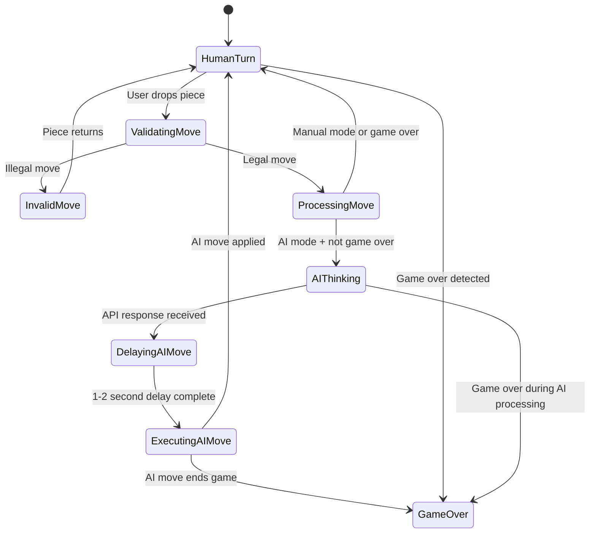

# AI vs Human Game Flow Architecture

## Executive Summary

This document outlines the architectural design for implementing "Play vs AI (Black)" functionality in the chess coaching application. The design leverages existing systems and API responses to create a seamless human vs AI experience while maintaining backward compatibility with manual play.

## Current System Analysis

### Key Components
- **useChess Hook**: Manages game state via chess.js instance, handles moves via `onPieceDrop()`
- **GamePage Component**: Controls board interaction through `allowDragging` prop
- **Dify API Integration**: Already provides `bestMove` in coaching responses
- **Game Logging**: Tracks all moves through `useGameLog` hook

### Existing Flow
```
User Move → onPieceDrop() → Chess.js Validation → State Update → API Call → Coaching Response
```

## Architecture Design

### 1. State Management Extension

#### New State Variables in useChess
```typescript
interface ChessGameState {
  // Existing state...
  fen: string;
  turn: ChessColor;
  gameOver: boolean;
  
  // New AI-related state
  isAiMode: boolean;           // AI game mode toggle
  isAiThinking: boolean;       // AI is processing/moving
  aiColor: 'b';                // AI always plays black
  pendingAiMove: string | null; // UCI move waiting to be executed
}
```

#### State Transitions
- `isAiMode`: Toggled via UI, only allowed when `historySan.length === 0`
- `isAiThinking`: True from human move completion until AI move execution
- `pendingAiMove`: Stores UCI move from API response until execution

### 2. Game Flow State Machine



### 3. Enhanced onPieceDrop Pipeline

#### Current Flow Enhancement
```typescript
const onPieceDrop = useCallback((from: string, to: string): boolean => {
  // 1. Existing validation and state update
  const move = gameRef.current.move({ from, to, promotion: 'q' });
  if (move == null) return false;
  
  // 2. Update UI state (existing)
  updateGameState();
  
  // 3. Record move in game log (existing)
  gameLog.recordAfterMove(gameRef.current, move);
  
  // 4. Send API request (existing)
  setIsLoadingInsights(true);
  postCoachGrade(payload).then(resp => {
    const insights = parseDifyAnswer(resp);
    setInsights(insights);
    
    // 5. NEW: Handle AI move if in AI mode
    if (isAiMode && !gameRef.current.isGameOver() && insights?.bestMove) {
      handleAiMoveResponse(insights.bestMove);
    }
  });
  
  return true;
}, [isAiMode, handleAiMoveResponse]);
```

### 4. AI Move Execution Pipeline

#### New Functions in useChess

```typescript
/**
 * Process AI move response with delay
 */
const handleAiMoveResponse = useCallback((bestMove: { uci: string, san: string }) => {
  setIsAiThinking(true);
  setPendingAiMove(bestMove.uci);
  
  // Natural delay: 1-2 seconds
  const delay = 1000 + Math.random() * 1000;
  setTimeout(() => {
    executeAiMove(bestMove.uci);
  }, delay);
}, []);

/**
 * Execute AI move and update game state
 */
const executeAiMove = useCallback((uciMove: string) => {
  try {
    const moveResult = applyUciMove(gameRef.current, uciMove);
    if (!moveResult) {
      console.error('[AI] Invalid UCI move:', uciMove);
      setIsAiThinking(false);
      setPendingAiMove(null);
      return;
    }
    
    // Update game state
    updateGameState();
    gameLog.recordAfterMove(gameRef.current, moveResult);
    
    // Clear AI state
    setIsAiThinking(false);
    setPendingAiMove(null);
    
  } catch (error) {
    console.error('[AI] Move execution failed:', error);
    setIsAiThinking(false);
    setPendingAiMove(null);
  }
}, [updateGameState, gameLog]);
```

### 5. UCI Move Utilities

#### New Utility Functions
```typescript
/**
 * Convert UCI notation to chess.js move and apply it
 */
function applyUciMove(game: Chess, uci: string): any | null {
  const from = uci.slice(0, 2);
  const to = uci.slice(2, 4);
  const promotion = uci.length > 4 ? uci[4] : undefined;
  
  return game.move({ from, to, promotion });
}

/**
 * Validate UCI move format
 */
function isValidUciFormat(uci: string): boolean {
  return /^[a-h][1-8][a-h][1-8][qrbn]?$/.test(uci);
}
```

### 6. Board Interaction Control

#### Enhanced allowDragging Logic
```typescript
// In GamePage.tsx
const allowDragging = useMemo(() => {
  if (gameOver) return false;
  if (isAiThinking) return false;
  if (isAiMode && turn === 'b') return false; // AI's turn
  return true;
}, [gameOver, isAiThinking, isAiMode, turn]);
```

### 7. UI Components

#### AI Mode Toggle Button
```typescript
// New component in GamePage.tsx
<Button
  label={isAiMode ? "AI Mode: ON" : "AI Mode: OFF"}
  icon={isAiMode ? "pi pi-robot" : "pi pi-user"}
  onClick={toggleAiMode}
  disabled={historySan.length > 0} // Prevent mid-game changes
  className="w-full"
  severity={isAiMode ? "success" : "secondary"}
/>
```

#### AI Thinking Indicator
```typescript
// Enhanced turn display
{gameOver ? (
  <div className="text-2xl font-bold text-red-600">
    {gameResult}
  </div>
) : isAiThinking ? (
  <div className="text-xl font-semibold text-orange-500">
    <i className="pi pi-spin pi-spinner mr-2"></i>
    AI is thinking...
  </div>
) : (
  <div className="text-xl font-semibold text-primary">
    {turn === 'w' ? 'White to move' : 
     isAiMode ? 'AI (Black) to move' : 'Black to move'}
  </div>
)}
```

### 8. Error Handling Strategy

#### Edge Cases and Recovery
1. **Invalid UCI from API**: Log error, clear AI thinking state, continue game
2. **API timeout during AI turn**: Show error message, allow manual move
3. **Game over during AI processing**: Cancel pending AI move, show result
4. **Network errors**: Graceful degradation to manual mode

#### Error Recovery Functions
```typescript
const handleAiError = useCallback((error: string) => {
  console.error('[AI] Error:', error);
  setIsAiThinking(false);
  setPendingAiMove(null);
  // Could show toast notification to user
}, []);
```

### 9. Integration Points

#### Game Log Integration
- AI moves recorded identically to human moves
- No changes needed to existing logging system
- Move metadata includes AI flag for analytics

#### Coaching Integration  
- AI moves still trigger coaching analysis
- Coaching insights still generated for human moves
- bestMove extraction happens regardless of game mode

## Implementation Strategy

### Phase 1: Core Infrastructure
1. Extend `useChess` with AI state variables
2. Create UCI utility functions
3. Implement basic AI move execution pipeline

### Phase 2: UI Integration
4. Add AI mode toggle button to GamePage
5. Update board interaction controls
6. Add AI thinking visual feedback

### Phase 3: Polish & Error Handling
7. Implement comprehensive error handling
8. Add natural timing delays
9. Test edge cases and game over scenarios

### Phase 4: Documentation & Testing
10. Document all new functions and state
11. Create integration tests for AI flow
12. Validate backward compatibility

## Risk Mitigation

### Potential Issues
- **Race Conditions**: Human move while AI thinking → Prevent with UI controls
- **Invalid API Responses**: Missing bestMove field → Graceful fallback
- **Network Latency**: Slow API responses → Timeout handling
- **Game State Corruption**: Invalid UCI moves → Validation and recovery

### Mitigation Strategies
- Comprehensive input validation on all UCI moves
- Timeout mechanisms for AI move processing
- State consistency checks before move execution
- Fallback to manual mode on critical errors

## Performance Considerations

- AI thinking state prevents unnecessary re-renders
- UCI move validation is lightweight
- Game state updates follow existing patterns
- No additional API calls required

## Backward Compatibility

- All existing functionality preserved
- Manual play mode unchanged
- Existing save/load game functionality works
- No breaking changes to existing components

## Future Enhancements

- Support for AI playing as White
- Difficulty level selection
- AI personality customization
- Move strength indicators
- Game analysis with AI suggestions
