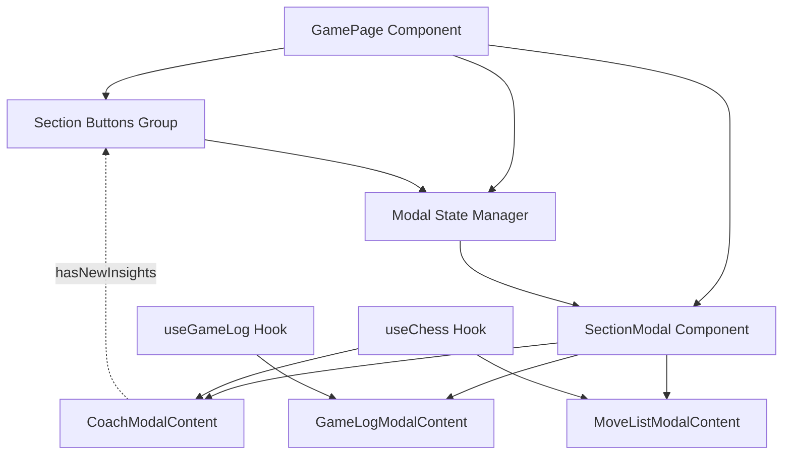

# Chess Coach Modal System Architecture

## Overview

This document outlines the architectural design for converting the chess coach side panel from fixed sections to a button + modal interface system. The design leverages the existing HintModal pattern and PrimeReact Dialog component to create a cohesive, accessible modal system.

## System Architecture



## Component Architecture

### 1. SectionModal Component

**Purpose**: Reusable modal wrapper component that follows the HintModal pattern.

**Props Interface**:
```typescript
interface SectionModalProps {
  visible: boolean;
  onHide: () => void;
  sectionType: 'coach' | 'gamelog' | 'movelist';
  title: string;
  children: React.ReactNode;
  size?: 'small' | 'medium' | 'large';
  scrollable?: boolean;
}
```

**Features**:
- Consistent styling with existing modal system
- Responsive sizing based on content type
- Keyboard navigation support (ESC to close, focus management)
- Accessibility attributes (ARIA labels, roles)
- Dismissable mask and close on escape

### 2. Section Content Components

#### CoachModalContent
- **Purpose**: Extract existing CoachPanel content without Panel wrapper
- **Props**: Same as current CoachPanel props
- **Features**: 
  - Maintains all existing functionality (expandable text, accordion, hint button)
  - Preserves "New" badge behavior and auto-viewing logic
  - Optimized spacing for modal context

#### GameLogModalContent  
- **Purpose**: Extract existing GameLogPanel content without Panel wrapper
- **Props**: No props (uses useGameLog hook internally)
- **Features**:
  - Maintains FEN display, move tracking, and export functionality
  - Optimized layout for modal viewing

#### MoveListModalContent
- **Purpose**: Extract existing MoveList content without Panel wrapper  
- **Props**: `{ history: string[] }`
- **Features**:
  - Maintains move pair formatting and scrolling
  - Enhanced modal-optimized styling

### 3. Section Buttons Component

**Purpose**: Centralized button group for opening section modals.

**Props Interface**:
```typescript
interface SectionButtonsProps {
  onOpenCoach: () => void;
  onOpenGameLog: () => void;
  onOpenMoveList: () => void;
  hasNewInsights?: boolean;
  moveCount: number;
}
```

**Button Specifications**:
- **Coach Panel Button**: 
  - Label: "Coach Panel"
  - Icon: "pi pi-user"
  - Visual indicator: Pulsing badge when `hasNewInsights` is true
  - Severity: "secondary"

- **Game Log Button**:
  - Label: "Game Log" 
  - Icon: "pi pi-code"
  - Severity: "secondary"

- **Move List Button**:
  - Label: "Move List"
  - Icon: "pi pi-list"
  - Badge: Show move count when > 0
  - Severity: "secondary"

## State Management Strategy

### Modal State Hook

Create a custom hook to manage which modal is open:

```typescript
type SectionType = 'coach' | 'gamelog' | 'movelist' | null;

interface UseSectionModalsReturn {
  activeModal: SectionType;
  openModal: (section: SectionType) => void;
  closeModal: () => void;
  isModalOpen: (section: SectionType) => boolean;
}

function useSectionModals(): UseSectionModalsReturn
```

**Key Features**:
- Only one modal open at a time
- Automatic closing when switching between modals
- Clear state management for active modal tracking

## Layout Integration

### GamePage Layout Changes

**Before**: 3 fixed sections in right column taking full vertical space
**After**: 5 buttons (2 existing + 3 new) in compact vertical stack

**Layout Structure**:
```
Right Column (lg:col-3):
├── Control Buttons Group
│   ├── Undo Move Button
│   └── New Game Button  
└── Section Buttons Group
    ├── Coach Panel Button (with "New" indicator)
    ├── Game Log Button
    └── Move List Button (with move count)
```

## Modal Sizing & Responsive Design

### Size Configurations

- **Coach Panel Modal**: Large (complex content with accordions)
  - Desktop: 90vw max-width 800px
  - Mobile: 95vw max-width 500px
  
- **Game Log Modal**: Medium (structured data display)
  - Desktop: 90vw max-width 600px
  - Mobile: 95vw max-width 400px
  
- **Move List Modal**: Small (simple list)
  - Desktop: 90vw max-width 400px
  - Mobile: 95vw max-width 350px

### Responsive Behavior

- All modals use `maxHeight: '80vh'` with internal scrolling
- Touch-friendly button sizes on mobile (min 44px touch targets)
- Proper spacing for mobile interactions

## Data Flow Preservation

### Existing Data Dependencies

1. **Coach Panel**:
   - Source: `useChess()` hook
   - Props: `insights`, `hasNewInsights`, `isLoadingInsights`, `onMarkInsightsViewed`, `lastSan`, `gameOver`, `gameResult`
   - Flow: GamePage → CoachModalContent (unchanged)

2. **Game Log Panel**:
   - Source: `useGameLog()` hook (internal to component)
   - Props: None
   - Flow: Internal hook usage (unchanged)

3. **Move List**:
   - Source: `useChess()` hook
   - Props: `historySan`
   - Flow: GamePage → MoveListModalContent (unchanged)

## User Experience Design

### Visual Indicators

1. **Coach Panel "New" Badge**:
   - Appears on Coach Panel button when `hasNewInsights` is true
   - Pulsing animation (respects prefers-reduced-motion)
   - Auto-dismisses when modal is opened and viewed

2. **Move Count Badge**:
   - Shows on Move List button when moves > 0
   - Format: Simple count (e.g., "12")

### Accessibility Features

1. **Keyboard Navigation**:
   - Tab order: Control buttons → Section buttons → Modal content
   - ESC key closes active modal
   - Focus returns to trigger button on modal close

2. **Screen Reader Support**:
   - Proper ARIA labels for all buttons
   - Modal announcements when opened
   - Status announcements for "New" indicators

3. **Motion Preferences**:
   - Respects `prefers-reduced-motion` for badge animations
   - Smooth modal transitions where appropriate

## Implementation Phases

### Phase 1: Core Infrastructure
1. Create SectionModal base component
2. Implement useSectionModals hook
3. Create extracted content components

### Phase 2: UI Integration  
4. Create SectionButtons component
5. Update GamePage layout
6. Implement visual indicators

### Phase 3: Polish & Testing
7. Add responsive sizing
8. Implement accessibility features
9. Test data flow preservation
10. Verify "New" badge behavior

## Technical Considerations

### Performance
- Modal content components only render when modal is open
- Existing data hooks remain unchanged (no performance impact)
- Lazy loading not needed due to small component sizes

### Maintainability
- Clear separation of concerns between modal wrapper and content
- Existing component logic preserved in content components
- Centralized modal state management

### Backward Compatibility
- All existing functionality preserved
- Same data flows and hook usage
- No breaking changes to useChess or useGameLog hooks

## Success Criteria

1. **Functionality**: All existing features work identically in modal format
2. **UX**: Improved information hierarchy with on-demand sections
3. **Accessibility**: Full keyboard navigation and screen reader support
4. **Performance**: No degradation in render performance
5. **Mobile**: Better mobile experience with focused modal content
6. **Visual**: Consistent design language with existing modal system

## File Structure

```
src/
├── app/components/
│   ├── modals/
│   │   ├── SectionModal.tsx
│   │   ├── CoachModalContent.tsx
│   │   ├── GameLogModalContent.tsx
│   │   └── MoveListModalContent.tsx
│   └── SectionButtons.tsx
├── hooks/
│   └── useSectionModals.ts
└── pages/
    └── GamePage.tsx (updated)
```

This architecture provides a robust, accessible, and maintainable solution for converting the side panel to a modal-based interface while preserving all existing functionality and improving the overall user experience.